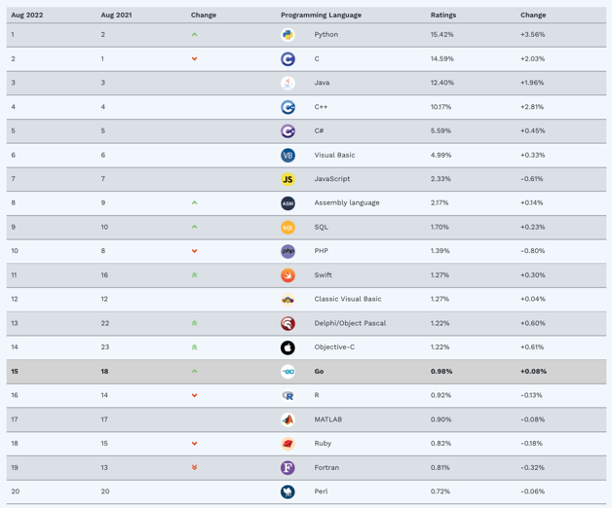

# Warum Python

Es gibt zahlreiche und sehr unterschiedliche Programmiersprachen. Einige sind sehr bekannt (z.B. [Java](https://de.wikipedia.org/wiki/Java-Technologie#Programmiersprache_Java), [C](https://de.wikipedia.org/wiki/C_(Programmiersprache)), oder [Python](https://de.wikipedia.org/wiki/Python_(Programmiersprache))), andere sind eher Nischensprachen (z.B. [R](https://de.wikipedia.org/wiki/R_(Programmiersprache)), [Julia](https://de.wikipedia.org/wiki/Julia_(Programmiersprache)) oder [Scheme](https://de.wikipedia.org/wiki/Scheme)), die entweder nur für spezielle Anwendungszwecke entwickelt wurden oder sich aus anderen Gründen für die breite Masse nicht durchgesetzt haben. Neue Programmiersprachen kommen in unregelmäßigen Abständen hinzu. So hat Google z.B. erst kürzlich die Entwicklung einer [neuen Sprache](https://thenewstack.io/google-launches-carbon-an-experimental-replacement-for-c/) angekündigt.

In diesem Skript soll nicht nur theoretisch über Datenanlayse gesprochen werden, sondern auch ganz praktisch Daten analysiert werden. Hierzu werden wir die Programmiersprache Python nutzen. Wieso aber genau Python und nicht z.B. R oder Java?

Bei der Wahl der Programmiersprache ist die Entscheidung nicht zufällig auf `Python` gefallen. Prinzipiell können zwar viele Programmiersprachen dieselben Probleme mehr oder weniger gut lösen. Es ist also nicht so, dass das Thema Datenanalyse oder Business Analytcis ausschließlich mit Python adressiert werden könnte. So würde sich z.B. `R` oder `Julia` würde sich z.B. `auch hervorragend geeignet`. Dennoch gibt es vier Kriterien, die eine Programmiersprache aus meiner Sicht erfüllen sollte, um besonders geeignet zu sein:

1. Die Sprache sollte populär sein

2. Die Sprache sollte "einfach" zu erlernen sein

3. Die Sprache sollte für Datenanalyse geeignet sein

4. Die Sprache sollte für weitere Anwendungsfälle geeignet sein


## 1. Python ist populär

Ein Entscheidungskriterium ist die Popularität. Python hat seit seiner Erfindung in den 90er Jahren enorm an Beliebtheit gewonnen und wird aktuell von sehr vielen Softwareentwicklern und Datenanalysten genutzt und ist im Ranking der beliebtesten Programmiersprachen[^1] mittlerweile auf Platz 1, d.h. auch vor Java oder C. 

[^1]: Methodisch ist nicht eindeutig zu bestimmen, welche Programmiersprache die beliebteste ist. Insofern gibt es verschiedene Rankings. Hier wurde ein bekanntes Ranking ausgewählt. Es gibt jedoch auch andere Rankings. In diesen ist Python nicht immer auf Platz 1, aber in den meisten Fällen auf den ersten drei Plätzen zu finden. 


```{dropdown} Klick: Popularität verschiedener Programmiersprachen


Quelle: [Tiobe-Ranking](https://www.tiobe.com/tiobe-index/))
```

Eine Programmiersprache kann gut oder schlecht sein ganz unabhängig von ihrer Popularität. Dennoch ist die Popularität aus unserer Sicht ein sehr wichtiges Kriterium. 

Zum einen ist es wesentlich einfacher Unterstützung zu finden, wenn man ein bestimmtes Problem in Python nicht lösen kann. So gibt es unzählige Lehrbücher und -tutorials, die einem beim Erlernen der Programmiersprachen helfen. Aus unserer Sicht noch wichtiger: es gibt eine sehr große Online-Community, die bei Fragen unterstützen kann. Im Rahmen dieses Kurses werden Sie auf Programmierprobleme stoßen: 

- Ihr Code produziert Fehlermeldungen, 
- Sie wissen nicht mehr, wie die geeignete Funktion zum Visualisieren von Balkencharts ist oder 
- Ihnen fehlt der Ansatz, wie Sie ein Problem konkret angehen sollen.  

````{margin} 
```{admonition} Stackoverflow
:class: tip
Besonders hilfreich ist hierbei das Online-Forum [Stackoverflow](https://stackoverflow.com/questions/tagged/python), in der Sie nach Antworten auf bereits gestellte Fragen suchen oder eigene Fragen stellen können. 
```
````

Zum anderen sorgt die Popularität von Python für eine praktische Relevanz in Unternehmen. Auch wenn Sie in Ihrem zukünftigen Job vielleicht nicht programmieren werden (müssen), ist es dennoch hilfreich zu wissen, dass Python mit hoher Wahrscheinlichkeit in Ihrem zukünftigen Unternehmen genutzt wird. Oder sollten Sie vorschlagen, Python für bestimmte (z.B. Daten-) Analysen zu nutzen, so wird die IT-Abteilung dies sicherlich zulassen. 


## 2. Python ist einfach(er)

Die grundlegenden Konzepte einer Programmiersprache sind oft sehr ähnlich und Programmieren lernen erfordert - wie jede andere Tätigkeit - Zeit und Erfahrung. Dennoch unterscheiden sich Programmiersprachen oft in Ihrer Komplexität für Anfänger. So gibt es Programmiersprachen, die darfür bekannt sind, sehr schwer erlernbar zu sein (z.B. [Rust](https://de.wikipedia.org/wiki/Rust_(Programmiersprache))). Andere Programmiersprachen gelten als eher einfach zu erlernen. Python gilt als eine eher einfach zu erlernende Programmiersprache. Dies bedeutet nicht, dass Python einfach per se ist. Vielmehr ist damit oft die **Syntax** der Sprache gemeint, d.h. welche Begriffe und Worte fehlerfreie Programme liefen. Darüber hinaus sind andere Dinge - wie z.B. die Art der Typisierung - wichtig. 

Beispiel: stellen Sie sich vor, wir möchten das arithmetische Mittel einer Zahlenreihe berechnen (engl. `mean`). 

Schauen wir uns an, wie wir dies in **Rust** und **Python** umsetzen können.[^2] 

[^2]: Beide Beispiele sind aus [rosettacode](https://rosettacode.org/wiki/Averages/Arithmetic_mean#Rust) und im Falle für Python leicht adaptiert. 

**Rust**
```{code} Java
fn sum(arr: &[f64]) -> f64 {
    arr.iter().fold(0.0, |p,&q| p + q)
}

fn mean(arr: &[f64]) -> f64 {
    sum(arr) / arr.len() as f64
}

fn main() {
    let v = &[2.0, 3.0, 5.0, 7.0, 13.0, 21.0, 33.0, 54.0];
    println!("mean of {:?}: {:?}", v, mean(v));

    let w = &[];
    println!("mean of {:?}: {:?}", w, mean(w));
}
```

**Python**
```{code} Pytho
from statistics import mean
m = mean([2.0, 3.0, 5.0, 7.0, 13.0, 21.0, 33.0, 54.0])
print(m)
```

Welche Sprache finden Sie intuitiver oder einfacher zu lesen? Die meisten Leser*innen werden das Beispiel in Python wegen der intuitiven Syntax einfacher finden. Auch wenn komplexe Programme in Python ähnlich komplex werden (können), wie in jeder anderen Programmiersprache, hat diese einfache(re) Syntax einen großen Vorteil: Sie werden schneller Fortschritte machen und können bereits nach kurzer Zeit praxisrelevante Skripte schreiben.

## 3. Python ist Datenanalyse

Ein Grund für die große Popularität und insbesondere das starke Wachstum von Python ist, dass Python insbesondere auch im Bereich Datenanalyse eingesetzt wird. So hat sich Python als eine der weit verbreitetsten Sprachen im Bereich `Datenaufbereitung`, `Machinelles Lernen` und `Deep Learning` entwickelt. Durch die einfache Syntax ist Python sehr gut geeignet, um schnell Prototypen für komplexe Datenanalysethemen zu erstellen. Dies hat dazu geführt, dass in den letzten Jahren eine Vielzahl von Modulen und Packages (d.h. Bibliotheken, die die Standardsprache erweitern) entstanden sind. Diese `Add-ons`, sind teilweise von großen Unternehmen, wie Google oder Facebook, (mit)entwickelt worden und sind frei verfügbar. Die Lösung von komplexen Datenanalysethemen ist insofern durch die Vielzahl an geeigneten Hilfsmitteln sehr viel einfacher und mächtiger geworden und erfordert (teilweise) keine jahrelange Programmiererfahrung. Zusatzmodule wie `pandas`, `numpy`, `matplotlib` oder `scikit-learn` - diese werden Sie in den folgenden Kapiteln noch kennenlernen - haben Python zu einer Art Schweizer Taschenmesser der Datenanalyse - insbesondere auch für Programmieranfänger - gemacht. 


## 4. Python ist Allzweckwaffe

Auch andere Sprachen sind für das Thema Datenanalyse sehr geeignet; insbesondere `R` ist in den Bereichen Aufbereitung von Daten und statistischer Analyse führend. Jedoch hat Python einen Vorteil gegenüber einer Sprache wie R: Python ist eine sogenannte "all purpose programming language", d.h. Python kann auch andere Dinge sehr gut. So wird Python auch zur Entwicklung von Software und Webapps oder Automatisierung von Prozessen genutzt. Der Einsatzzweck ist im Grunde nicht beschränkt. Im Rahmen dieses Kurses erscheint mir dies als Vorteil, da Sie als Einsteiger so in den Genuss einer Programmiersprache kommen, deren Einsatzzweck Sie für sich persönlich beliebig erweitern können. Das so vermittelte Programmierwissen kann so also zukünftig - sofern tatsächlich weitergehendes Interesse besteht - breit eingesetzt werden. 


